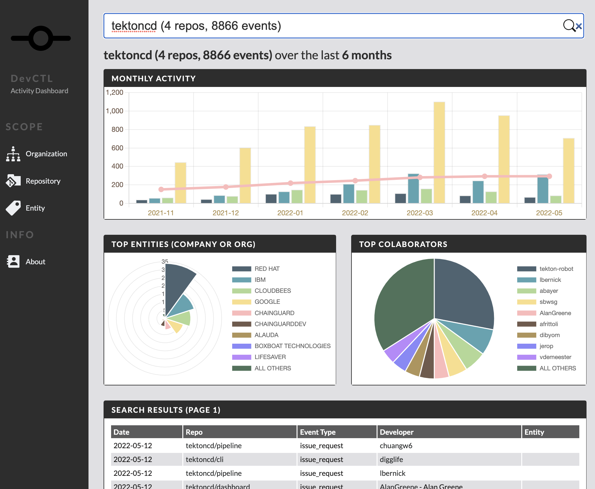

# dctl

`dctl` is an open source project aiming to provide a quick insight into the activity of a single repo or an entire GitHub organization. Some of the questions it can help you answer:
            
* Volume of collaboration events over time (forks, PRs, PR reviews, issue, and issue comments)
* Number of developers and their entity affiliation per period (company or organization)

> The list of additional insight being worked on is available [here](https://github.com/mchmarny/dctl/issues?q=is%3Aissue+is%3Aopen+label%3Ainsight)



> Hope you find this tool helpful. [Let me know](https://twitter.com/mchmarny) if you have any questions.

## Install 

On Max and Linux you can install `dctl` with [Homebrew](https://brew.sh/):

```shell
brew tap mchmarny/dctl
brew install dctl
```

All new release will be automatically picked up with `brew upgrade`.

`dctl` also provides pre-build releases for Mac, Linux, and Windows for both, AMD and ARM. See [releases](https://github.com/mchmarny/dctl/releases) to download the supported distributable for your platform/architecture combination. Alternatively, you can build your own version, see [BUILD.md](docs/BUILD.md) for details.

## Why

One of the core principles on which `dctl` is built is that open source contributions are more than just PRs. And, while GitHub does provide repo-level activity charts and Grafana has a [plugin for GitHub](https://grafana.com/grafana/plugins/grafana-github-datasource/) (e.g. [CNCF Grafana Dashboard](https://k8s.devstats.cncf.io/)), there isn't really anything out there that's both, free and simple to use that provides that data.

## How

`dctl` imports all contribution metadata for a specific repo(s) using the [GitHub API](https://docs.github.com/en/rest), and augments that data with developer affiliations from sources like [CNCF](https://github.com/cncf/gitdm). More about importing data [here](docs/IMPORT.md).

Once downloaded, `dctl` exposes that data using a local UI with an option to drill-down on different aspects of the project activity (screenshot above). The instructions on how to start the integrated server and access the UI in your browser are located [here](docs/SERVER.md).

`dctl` can also be used to query the imported data in CLI and output JSON payloads for subsequent postprocessing in another tool (e.g. [jq](https://stedolan.github.io/jq/)). More about the CLI query option [here](docs/QUERY.md)

Whichever way you decide to use `dctl`, you will be able to use time period, contribution type, and developer name filters to further scope your data and identify specific trends with direct links to the original detail in GitHub for additional context. 

And, since all this data is cached locally in [sqlite](https://www.sqlite.org/index.html) DB, you can even use another tool to further customized your queries using SQL without the need to re-download data. More about that [here](docs/QUERY.md)

## Usage 

`dctl` is a dual-purpose utility that can be either used as a CLI and as a server that can be accessed locally with your browser:

* [Authenticating to GitHub](#authentication)
* [Importing Data](docs/IMPORT.md)
* [Querying Data](docs/QUERY.md)
* [Using Server](docs/SERVER.md)

## Authentication 

To import data, `dctl` users GitHub API. While you can use GitHub API without authentication, to avoid throttling, and to get access to the higher API rate limits, `dctl` uses OAuth-based authentication to obtain a GitHub user token:

> `dctl` doesn't ask for any access scopes, so the resulting token has only access to already public data

To authenticate to GitHub using `dctl`:

```shell
dctl auth
```

The result should look something like this: 

```shell
1). Copy this code: E123-4567
2). Navigate to this URL in your browser to authenticate: https://github.com/login/device
3). Hit enter to complete the process:
```

Follow these steps. Once you enter the provided code in the GitHub UI prompt and hit enter, `dctl` will persist the token in your home directory for all subsequent queries. Should you need to, you can revoke that token in your [GitHub Settings](https://docs.github.com/en/developers/apps/managing-oauth-apps/deleting-an-oauth-app). 

Once authenticated, try [importing some data](docs/IMPORT.md).

## Disclaimer

This is my personal project and it does not represent my employer. I take no responsibility for issues caused by this code. I do my best to ensure that everything works, but if something goes wrong, my apologies is all you will get.
