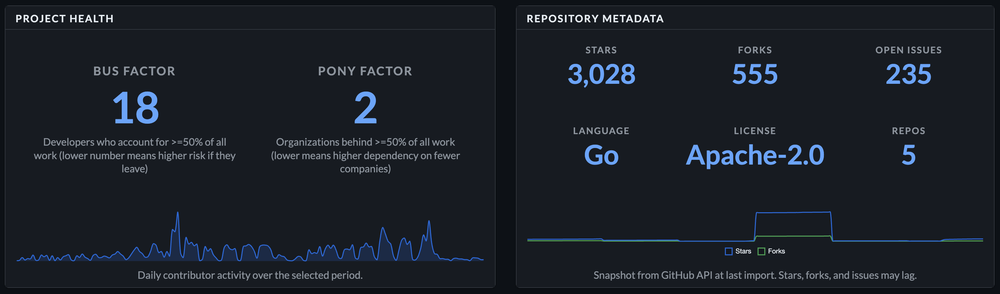
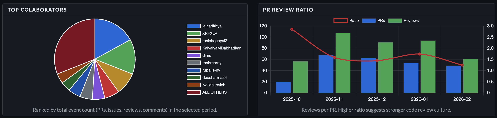

# dctl

[](https://github.com/mchmarny/dctl/actions/workflows/test-on-push.yaml)
[](https://github.com/mchmarny/dctl/actions/workflows/codeql-analysis.yml)
[](https://github.com/mchmarny/dctl/releases/latest)
[](LICENSE)

Community health analytics for GitHub organizations and repositories. `dctl` imports contribution data from the GitHub API, enriches it with developer affiliations, and surfaces project health insights through a local dashboard.



## Features

- **Activity trends** -- monthly event volume (PRs, reviews, issues, comments, forks) with total and 3-month moving average
- **Bus factor / pony factor** -- minimum developers or organizations producing 50% of contributions
- **Contributor retention** -- new vs returning contributors per month
- **PR review ratio** -- PRs to reviews per month with ratio trend line
- **Time to close / merge** -- average days to close issues and merge PRs
- **Entity affiliations** -- top contributing companies/orgs with drill-down to individual developers (GitHub profile + CNCF gitdm)
- **Contributor reputation** -- two-tier scoring (shallow local, deep GitHub API) with known bot filtering
- **Repository metadata** -- stars, forks, open issues, language, license
- **Release cadence** -- monthly release counts (total vs stable)
- **Event search filters** -- filter by type, date range, username, or entity directly from the dashboard
- **Adjustable time period** -- dropdown adapts to available data range per search scope
- **Unified search** -- `org:name`, `repo:name`, or `entity:name` prefix syntax; all panels respect entity filter

## Install

### Homebrew (macOS / Linux)

```shell
brew tap mchmarny/dctl
brew install dctl
```

### Binary releases

Pre-built binaries for macOS, Linux, and Windows (amd64/arm64) are available on the [releases](https://github.com/mchmarny/dctl/releases/latest) page.

### Build from source

Requires [Go](https://go.dev/) 1.26+.

```shell
git clone https://github.com/mchmarny/dctl.git
cd dctl
make build
```

See [DEVELOPMENT.md](DEVELOPMENT.md) for details.

## Quick start

### 1. Authenticate

`dctl` uses GitHub's device flow for OAuth. The token is read-only (no scopes requested) and stored in your OS keychain.

```shell
dctl auth
```

### 2. Import data

Import everything for an org (events, affiliations, metadata, releases):

```shell
dctl import all --org <org>
```

Or target a specific repo:

```shell
dctl import all --org <org> --repo <repo>
```

Use `--fresh` to clear pagination state and re-import from scratch:

```shell
dctl import all --org <org> --fresh
```

See [docs/IMPORT.md](docs/IMPORT.md) for all import options.

### 3. View dashboard

```shell
dctl server
```


Opens your browser to `http://127.0.0.1:8080`. Use `--port` to change the port or `--no-browser` to suppress auto-open.

Use the search bar with prefix syntax to scope the dashboard:

| Prefix | Example | Scope |
|--------|---------|-------|
| `org:` | `org:nvidia` | All repos in an organization |
| `repo:` | `repo:skyhook` | Single repository |
| `entity:` | `entity:google` | Company/org affiliation |

No prefix defaults to org search.

### 4. Query via CLI

`dctl` also exposes data as JSON for scripting:

```shell
dctl query events --org knative --repo serving --type pr --since 2024-01-01
dctl query developer list --like mark
dctl query entity detail --name GOOGLE
```

See [docs/QUERY.md](docs/QUERY.md) for all query options.

### 5. Reset

Delete all imported data and start fresh:

```shell
dctl reset
```

Prompts for confirmation before deleting the database.



## Data sources

| Source | Data |
|--------|------|
| [GitHub API](https://docs.github.com/en/rest) | PRs, issues, comments, reviews, forks, repo metadata, releases |
| [cncf/gitdm](https://github.com/cncf/gitdm) | Developer-to-company affiliations |

Entity names are normalized automatically. Use `dctl import substitutions` to correct misattributions:

```shell
dctl import substitutions --type entity --old "INTERNATIONAL BUSINESS MACHINES" --new "IBM"
```

## Architecture

All data is stored locally in a [SQLite](https://www.sqlite.org/) database (`~/.dctl/data.db`). No data leaves your machine. The dashboard is a local-only HTTP server with no external dependencies at runtime.

```
GitHub API --> dctl import --> SQLite --> dctl server --> localhost:8080
                                    \--> dctl query --> JSON (stdout)
```

## Verification

Release binaries are signed and attested in CI. No private keys — everything uses keyless [Sigstore](https://www.sigstore.dev/) OIDC via GitHub Actions.

### Verify checksum signature

```shell
cosign verify-blob \
  --bundle checksums-sha256.txt.sigstore.json \
  --certificate-identity-regexp 'github.com/mchmarny/dctl' \
  --certificate-oidc-issuer https://token.actions.githubusercontent.com \
  checksums-sha256.txt
```

### Verify build provenance

```shell
gh attestation verify <binary> -R mchmarny/dctl
```

### Inspect SBOM

Each binary has a corresponding SBOM (SPDX JSON) attached to the release.

## Contributing

Contributions are welcome. Please open an issue before submitting large changes. See [CONTRIBUTING.md](CONTRIBUTING.md) for guidelines and [DEVELOPMENT.md](DEVELOPMENT.md) for setup.

1. Fork and clone the repository
2. Create a feature branch
3. Run `make qualify` (tests, lint, vulnerability scan)
4. Submit a pull request

## License

[Apache 2.0](LICENSE)
