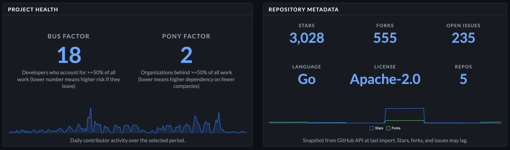
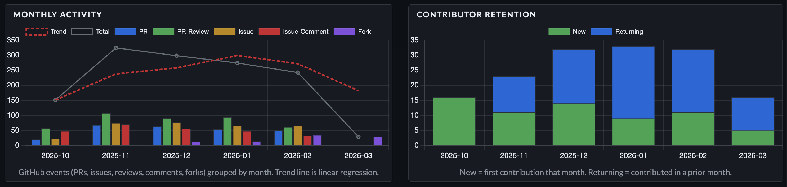
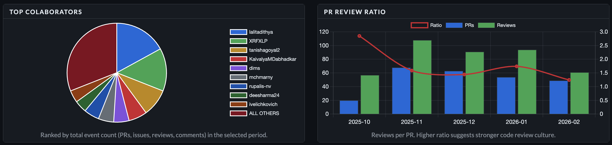
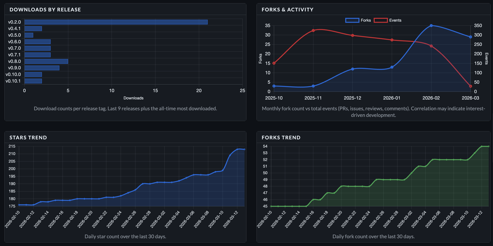

# devpulse

[](https://github.com/mchmarny/devpulse/actions/workflows/test-on-push.yaml)
[](https://goreportcard.com/report/github.com/mchmarny/devpulse)
[](https://pkg.go.dev/github.com/mchmarny/devpulse)
[](LICENSE)

Community health analytics for GitHub organizations and repositories. `devpulse` imports contribution data from the GitHub API, enriches it with developer affiliations, and surfaces project health insights through a local dashboard.



## Features

**Project Health**
- **Bus factor / pony factor** -- minimum developers or organizations producing 50% of contributions
- **Repository metadata** -- stars, forks, open issues, language, license with 30-day sparkline
- **Stars & forks trends** -- daily star and fork counts over the last 30 days with historical backfill

**Activity & Code**
- **Activity trends** -- monthly event volume (PRs, reviews, issues, comments, forks) with total and 3-month moving average
- **PR size distribution** -- pull requests bucketed by lines changed (S/M/L/XL) per month
- **Forks & activity** -- monthly fork count vs total event activity

**Velocity**
- **Lead time (PR to merge)** -- average days from PR creation to merge
- **Change failure rate** -- percentage of deployments causing failures (bug issues near releases + revert PRs)
- **Release cadence** -- monthly release counts (total, stable, deployments) with merge-to-main fallback
- **Release downloads** -- monthly download trends and top releases by download count

**Quality**
- **PR review ratio** -- PRs to reviews per month with ratio trend line
- **Review latency** -- average hours from PR creation to first review
- **Time to close** -- average days to close all issues vs bug issues near releases
- **Contributor reputation** -- two-tier scoring (shallow local, deep GitHub API) with known bot filtering

**Community**
- **Contributor retention** -- new vs returning contributors per month
- **Contributor momentum** -- rolling 3-month active contributor count with month-over-month delta
- **First-time contributor funnel** -- new contributor milestones per month (first comment, first PR, first merge)
- **Entity affiliations** -- top contributing companies/orgs with drill-down to individual developers (GitHub profile + CNCF gitdm)

**Dashboard**
- **Event search filters** -- filter by type, date range, username, or entity directly from the dashboard
- **Adjustable time period** -- dropdown adapts to available data range per search scope
- **Unified search** -- `org:name`, `repo:name`, or `entity:name` prefix syntax; all panels respect entity filter

## Install

### Homebrew (macOS / Linux)

```shell
brew tap mchmarny/tap
brew install devpulse
```

### Binary releases

Pre-built binaries for macOS, Linux, and Windows (amd64/arm64) are available on the [releases](https://github.com/mchmarny/devpulse/releases/latest) page.

### Build from source

Requires [Go](https://go.dev/) 1.26+.

```shell
git clone https://github.com/mchmarny/devpulse.git
cd devpulse
make build
```

See [DEVELOPMENT.md](DEVELOPMENT.md) for details.

## Quick start



### 1. Authenticate

`devpulse` uses GitHub's device flow for OAuth. By default the token requests the `repo` scope for private repository access. Use `--public` to skip the `repo` scope when you only work with public repos. The token is stored in your OS keychain.

```shell
devpulse auth            # private + public repo access (default)
devpulse auth --public   # public repo access only
```

Alternatively, set `GITHUB_TOKEN` to skip the auth command entirely:

```shell
export GITHUB_TOKEN=ghp_...
```

### 2. Import data

Import everything for an org (events, affiliations, metadata, releases, reputation):

```shell
devpulse import --org <org>
```

Or target specific repos:

```shell
devpulse import --org <org> --repo <repo1> --repo <repo2>
```

Use `--fresh` to clear pagination state and re-import from scratch:

```shell
devpulse import --org <org> --fresh
```

Update all previously imported data (no flags needed):

```shell
devpulse import
```

See [docs/IMPORT.md](docs/IMPORT.md) for all import options.

### 3. View dashboard

```shell
devpulse server
```



Opens your browser to `http://127.0.0.1:8080`. Use `--port` to change the port or `--no-browser` to suppress auto-open.

Use the search bar with prefix syntax to scope the dashboard:

| Prefix | Example | Scope |
|--------|---------|-------|
| `org:` | `org:nvidia` | All repos in an organization |
| `repo:` | `repo:skyhook` | Single repository |
| `entity:` | `entity:google` | Company/org affiliation |

No prefix defaults to org search.

### 4. Query via CLI

`devpulse` also exposes data as JSON for scripting:

```shell
devpulse query events --org knative --repo serving --type pr --since 2024-01-01
devpulse query developer list --like mark
devpulse query entity detail --name GOOGLE
```

See [docs/QUERY.md](docs/QUERY.md) for all query options.

### 5. Delete data

Remove imported data for a specific org or repo:

```shell
devpulse delete --org <org>                          # delete all data for org
devpulse delete --org <org> --repo <repo>            # delete data for specific repo
devpulse delete --org <org> --repo <repo> --force    # skip confirmation prompt
```

### 6. Reset

Delete all imported data and start fresh:

```shell
devpulse reset
```

Prompts for confirmation before deleting the database.



## Data sources

| Source | Data |
|--------|------|
| [GitHub API](https://docs.github.com/en/rest) | PRs, issues, comments, reviews, forks, repo metadata, releases |
| [cncf/gitdm](https://github.com/cncf/gitdm) | Developer-to-company affiliations |

Entity names are normalized automatically. Use `devpulse substitute` to correct misattributions:

```shell
devpulse substitute --type entity --old "INTERNATIONAL BUSINESS MACHINES" --new "IBM"
```

## Architecture

All data is stored locally in a [SQLite](https://www.sqlite.org/) database (`~/.devpulse/data.db`). No data leaves your machine. The dashboard is a local-only HTTP server with no external dependencies at runtime.

```
GitHub API --> devpulse import --> SQLite --> devpulse server --> localhost:8080
                                         \--> devpulse query --> JSON (stdout)
```

## Verification

Release binaries are signed and attested in CI. No private keys — everything uses keyless [Sigstore](https://www.sigstore.dev/) OIDC via GitHub Actions.

### Verify checksum signature

```shell
cosign verify-blob \
  --bundle checksums-sha256.txt.sigstore.json \
  --certificate-identity-regexp 'github.com/mchmarny/devpulse' \
  --certificate-oidc-issuer https://token.actions.githubusercontent.com \
  checksums-sha256.txt
```

### Verify build provenance

```shell
gh attestation verify <binary> -R mchmarny/devpulse
```

### Inspect SBOM

Each binary has a corresponding SBOM (SPDX JSON) attached to the release.

## Contributing

Contributions are welcome. Please open an issue before submitting large changes. See [CONTRIBUTING.md](CONTRIBUTING.md) for guidelines and [DEVELOPMENT.md](DEVELOPMENT.md) for setup.

1. Fork and clone the repository
2. Create a feature branch
3. Run `make qualify` (tests, lint, vulnerability scan)
4. Submit a pull request

## License

[Apache 2.0](LICENSE)
