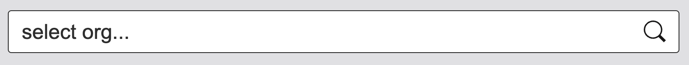
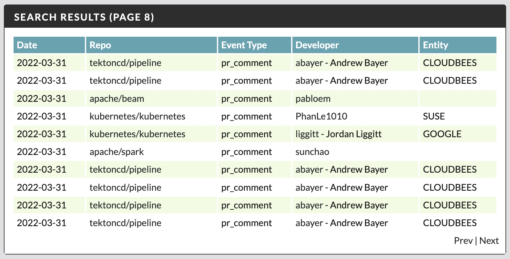

# dctl - server

> Assumes you have already [authenticated](../README.md)

Once the data has been imported, the easiest way to view it is to start a local server: 

```shell
dctl server
```

The result should be the information with the address:

```shell
INFO    server started on 127.0.0.1:8080
```

At this point you can use your browser to navigate to [127.0.0.1:8080](http://127.0.0.1:8080) to view the data. 

> You can change the port on which the server starts by providing the `--port` flag. 

## Usage 

The `dctl` server UI provides three scopes by which you can query your imported data. 

* Organization - Collection of multiple repositories
* Repository - Specific repo view of the downloaded data
* Affiliation - Developer entity view across all org/repos

Each view provides all downloaded data view by default, and offers a quick search bar to help you locate org, repo, or entity.



## Charts

Whichever scope you use, there will be three charts illustrating the data you selected. Let's review each one of the charts: 

> Note, these charts are also "clickable" which means you can for example click on a specific month in your timeline to filter the result only to that month, or click on entity to further filter that month's data to only the developers associated to that entity.  

### Timeline 

This is a timeline of the monthly contributions split by (PR, Issue, and their comments)


### Entity & Developer

This is a chart of the top entity affiliations represented by all the developers, and chart of the top individual developers who contributed to the imported repos. 


> Note, in both the entity and developer case, the `top` represents the volume of the contribution events, not on the actual size of the contribution (e.g. PR). 

## Events

Based on the scope, search, and chart selection, the events table will display a list of downloaded events that are matching your selection. The repo, event type, and developer name are directly linked to the detail in GitHub (e.g. profile, PR, Issue, etc).



### Disclaimer

This is my personal project and it does not represent my employer. I take no responsibility for issues caused by this code. I do my best to ensure that everything works, but if something goes wrong, my apologies is all you will get.
